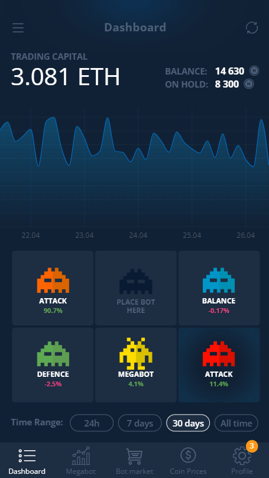

## REACT-BOTS

### SPA с графиком Recharts

#### Адаптировано под iPhone 6S (Safari Mobile) и Samsung S8 Plus (Chrome)

-   [Деплой проекта на Vercel](https://react-bots.vercel.app/)

---

### Как запускать проект

1. `npm install`

2. `npm run start` или `npm run build`

---

### Стек технологий проекта:

#### Основные зависимости:

-   React и ReactDOM

-   Шрифты Fontsource

-   Recharts для графиков

#### Dev зависимости:

-   Webpack и его плагины

-   Babel для транспиляции

-   TypeScript, @types-пакеты

-   SCSS loader
